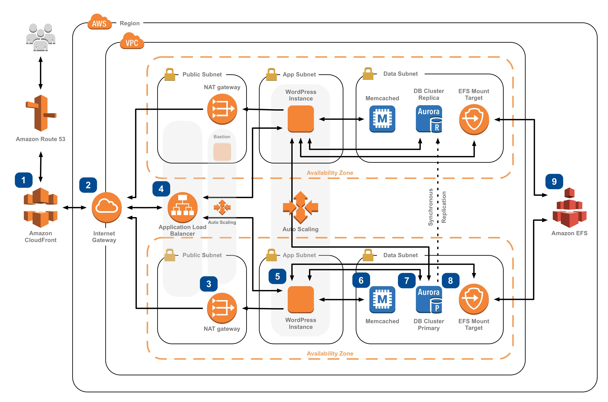

# Full Scalable WordPress on AWS

This reference architecture provides a set of YAML templates for deploying WordPress on AWS.

The templates works in the following AWS Regions:

* us-east-1
* us-east-2
* us-west-2


## Overview



The repository consists of a set of nested templates which are run in order from the master template. Run the master template to create the entire stack, entering the appropriate parameters. Nested templates can be run individually in order, entering the appropriate input parameters for each stack.


## Master Template

The master template receives all input parameters and passes them to the appropriate nested template which are executed in order based on conditions and dependencies.


### AWS Resources Created:

- Amazon Virtual Private Cloud (Amazon VPC)
- Internet Gateway (IGW)
- 3 x NAT Gateway (across all public subnets)
- Multiple Amazon VPC subnets (public & private) in 2 or 3 (if available) Availability Zones (AZs)
- Routing tables for public subnets - routing through IGW
- Routing tables for private subnets - routing through NAT Gateway
- Mulitple VPC Security Groups
- 1 x Bastion Auto Scaling Group (launching no instances) - in public subnets (public)
- Amazon Relational Database Service (Amazon RDS) Aurora cluster - in private subnets (data)
- Amazon Elastic File System (Amazon EFS) file system - with mount targets in private subnets (data)
- Amazon ElastiCache cache cluster (optional) - in private subnets (data)
- Amazon Elastic Load Balancing (Amazon ELB) Application Load Balancer (ALB) - in public subnets (public)
- 2 x Web Auto Scaling Group (launching 2 instances) - in private subnets (web)
- Amazon CloudFront distribution (optional)
- Amazon Route53 DNS record set (optional)

### Input Parameters

#### AWS Parameters
- EC2 Key Name Pair
- SSH Access CIDR block (to access bastion host)

#### File System Parameters
- Encrypted file system (boolean)
- AWS KMS Customer Master Key ARN (if enabling encryption and using customer-managed CMK)

#### Database Parameters
- Database Name
- Database Master Username
- Database Master Password
- Database Size
- Database Instance Class Type
- Create ElastiCache cluster (boolean)
- ElastiCache Node Type

#### Web Parameters
- Create CloudFront distribution (boolean)
- Create Route 53 record set (boolean)
- Web Instance Type

#### WordPress Parameters
- CloudFront ACM certificate ARN (must be requested from us-east-1)
- ALB ACM certificate ARN (must be requested from the stack region using the WordPress site domain name)
- WordPress Title
- WordPress Administrator Username
- WordPress Administrator Username Password
- WordPress Administrator Email Address
- WordPress Site Domain Name (e.g. 'example.com')
- WordPress Main Language of the site


## Steps to Run

To launch the entire stack and deploy a WordPress site on AWS launch the master.yml file in the AWS CloudFormation console.

Note. If you want to use Route53 update the line 419 (DnsHostId) in the file **wp-master.yml** with the Hosted Zone Id of your domain.


#### Optional: Encrypting Amazon EFS Data & Metadata at Rest

Amazon EFS integrates with AWS Key Management Service (KMS) to support encryting file system contents using AWS KMS Customer Master Keys (CMKs). In an encrypted file system, data and metadata are automatically encrypted before being written to the file system. Similarly, as data and metadata are read, they are automatically decrypted before being presented to the application. These processes are handled transparently by Amazon EFS, so you don’t have to modify WordPress to take advantage of encrypted file systems. Encryption at rest is enabled by default for file systems you create using this cloudformation template. This option is exposed as a configurable Cloudformation template parameter. 'true' creates an encrypted file system. 'false' creates an unencrypted file system. To use the AWS-managed CMK for Amazon EFS (key alias: aws/elasticfilesystem) leave the "Existing AWS KMS CMK for EFS" parameter empty. To use a specific customer-managed CMK (within this AWS account or another AWS account) enter the CMKs ARN in the "Existing AWS KMS CMK for EFS" parameter field.

#### Optional: Amazon Certificate Manager SSL/TLS Certificates

AWS Certificate Manager (ACM) is a service that lets you easily provision, manage, and deploy Secure Sockets Layer/Transport Layer Security (SSL/TLS) certificates for use with AWS services. SSL/TLS certificates provisioned through AWS Certificate Manager are free.

If you don't already have an SSL/TLS certificate for your domain name, it is recommended that you request one using ACM. For more information about requesting an SSL/TLS certificate using ACM, please read the [AWS Certificate Manager User Guide](http://docs.aws.amazon.com/acm/latest/userguide/acm-overview.html).

Use ACM to request a certificate or import a certificate into ACM. To use an ACM certificate with CloudFront (optional input parameter), you must request or import the certificate in the US East (N. Virginia) region. To use an ACM certificate with Amazon ELB - Application Load Balancer (optional input parameter), you must request or import the certificate in the region you create the CloudFormation stack. After you validate ownership of the domain names in your certificate, ACM provisions the certificate. Use the ACM certificate Amazon Resource Name (ARN) as the optional Cloudfront and/or Public ALB ACM certificate input parameters of the master template.

#### Stack Creation

There are two output URLs for the master template. The WPSiteURL will take you to your new WordPress site. It will be the site domain name if you provided one, the CloudFront URL if you chose to create a CloudFront distribution, or the domain name of the public application load balancer.  The second output URL will take you to the OpCache Status page for each EC2 instance in the AutoScaling group. By refreshing the page you will be able to verify OpCache has been enabled on each instance.

#### OPcache

OPcache is a byte-code cache engine running on each EC2 instance that caches precompiled PHP scripts that boosts performance of PHP applications like WordPress. It is recommended to use a caching engine like OpCache when serving PHP pages for a website from Amazon EFS.  OPcache can be configured to store it's cache in memory or on EBS volumes.

##### Recommended OPcache Configuration Settings

- Mount the EFS file system using the default Linux mount options identified in the [Amazon EFS User Guide](http://docs.aws.amazon.com/efs/latest/ug/mounting-fs-mount-cmd-general.html).
Changing some of the activating caching options from their defaults, like actimeo, acregmax, or acdirmax may generate significantly higher metadata operations by timing out the attribute caches more frequently. Careful testing is recommended if the defaults are not used.

- Increase the size of realpath_cache_size. Setting it to 512k is a good start but finding out how much realpath cache you’re actually using will help you fine tune this setting and be more precise. To find out how much real path cache you’re actually using, place the following php code snippet in a php file (you can use any name – for example realpathcache.php) and place it in your WordPress directory. Open a browser and point to this php file.  Refresh your page multiple times. The value being returned is the amount of memory in bytes realpath cache is using. Take note of the maximum value being returned after refreshing this page multiple times.  This, plus a little headroom, should be the value of the realpath_cache_size setting.
```
<?php
 print_r(realpath_cache_size());
?>
```

- Please get the number of php files using “find . -type f -print | grep php | wc -l” in your WordPress directory. This number should be smaller than your opcache.max_accelerated_files settings. This setting controls how many PHP files, at most, can be held in memory at once. It's important that your project has LESS FILES than whatever you set this at.

- The default value for opcache.memory consumption is 64 MB. Increasing this setting could improve performance by caching more files in memory. Consider setting this to a value of 512MB (opcache.memory_consumption=512) or more to improve performance. Testing different opcache.memory consumption values is recommended to optimize the performance for your particular workload. In case memory size turns out to be a limiting factor, the cloudformation template also configures opcache.file_cache to use local storage (an EBS or instance store volume). During testing we recommend disabling opcache.validate_timestamps so calls are not being made to the NFS server to ensure opcache’s coherency. It is not recommended that opcache.validate_timestamps be disabled in production.

**Original Source** https://github.com/awslabs/aws-refarch-wordpress
